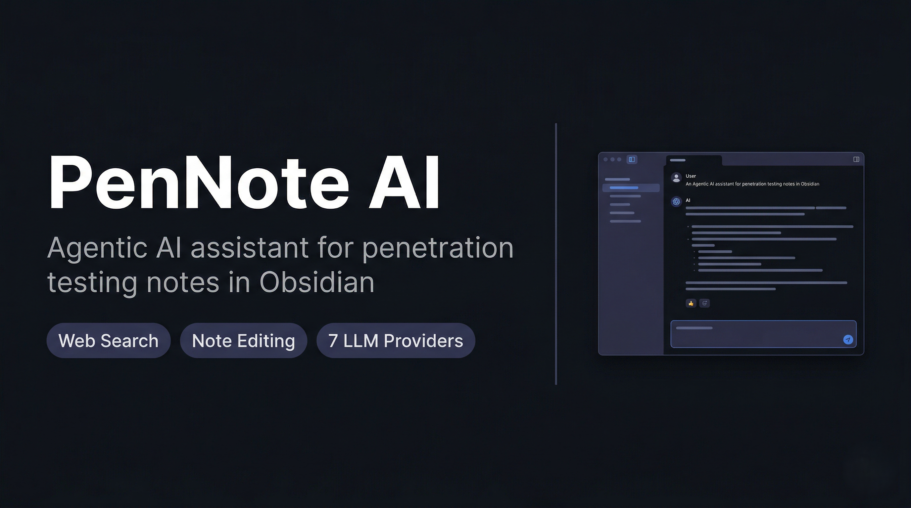

<p align="center">
  <h1 align="center">PenNote AI</h1>
</p>

<p align="center">
  
</p>

<p align="center">
  
  
  
  
  
</p>

<p align="center">
  An Obsidian plugin that acts as an agentic AI assistant for penetration testing notes.<br>
  It searches the web, crawls sources, and writes verified findings directly into your vault.
</p>

---

## Overview

PenNote AI embeds an autonomous agent into Obsidian. You give it an instruction — enrich a note, fill methodology gaps, add a command — and it uses web search, page crawling, and surgical note editing tools to complete the task without you leaving the editor.

All supported LLM providers use function calling. The agent plans, searches, verifies across sources, and only writes content it has confirmed from a crawled page.

---

## Requirements

| Requirement | Version |
|---|---|
| Node.js | 18 or later |
| Obsidian | 1.4.0 or later (desktop only) |
| LLM API key | Any one supported provider |

---

## Supported Providers

| Provider | Key source | Default model |
|---|---|---|
| Mistral AI | [console.mistral.ai](https://console.mistral.ai) | `mistral-large-latest` |
| OpenAI | [platform.openai.com](https://platform.openai.com) | `gpt-4o` |
| Anthropic (Claude) | [console.anthropic.com](https://console.anthropic.com) | `claude-opus-4-6` |
| Google Gemini | [aistudio.google.com](https://aistudio.google.com) | `gemini-2.5-pro` |
| xAI (Grok) | [console.x.ai](https://console.x.ai) | `grok-2-latest` |
| Groq | [console.groq.com/keys](https://console.groq.com/keys) | `moonshotai/kimi-k2-instruct` |
| OpenRouter | [openrouter.ai/keys](https://openrouter.ai/keys) | `anthropic/claude-opus-4-5` |

All providers except Anthropic use the OpenAI-compatible `/v1/chat/completions` endpoint. For Mistral the model is a dropdown; for all others it is a free-text field so you can enter any model the provider supports.

---

## Installation

### From the release

1. Download `main.js`, `manifest.json`, and `styles.css` from the [latest release](https://github.com/JoyGhoshs/PenNoteAI/releases/latest).
2. In your Obsidian vault navigate to `.obsidian/plugins/` and create a folder named `pennote-ai`.
3. Copy the three files into that folder.
4. In Obsidian go to **Settings → Community plugins**, enable community plugins if prompted, then enable **PenNote AI**.

### From source

```bash
git clone https://github.com/JoyGhoshs/PenNoteAI.git
cd PenNoteAI
npm install
node esbuild.config.mjs production
```

Copy the generated `main.js`, `manifest.json`, and `styles.css` into `.obsidian/plugins/pennote-ai/`.

---

## Configuration

1. Go to **Settings → PenNote AI**.
2. Select a provider from the **Active Provider** dropdown.
3. Enter your API key and model name.
4. Click **Test Connection** to verify.

---

## Usage

Open the panel with **Ctrl+P → Open PenNote AI panel** or via the ribbon icon. Select a mode from the dropdown, type your instruction, and press **Enter** or **Send**.

### Modes

| Mode | What it does |
|---|---|
| **Chat** | General assistant with full tool access |
| **Enrich note** | Searches the web and adds verified content to the active note |
| **Gap analysis** | Identifies missing methodology sections and fills them |
| **Add command** | Researches and adds a tool command with syntax, flags, and examples |
| **Search update** | Refreshes outdated content using targeted web searches |

### Agent tools

| Tool | Description |
|---|---|
| `search_web` | DuckDuckGo search with advanced operators |
| `crawl_url` | Fetches and extracts the full text of a URL |
| `read_note` | Reads a vault note by path |
| `patch_note_section` | Replaces the body of a named section |
| `upsert_note_bullet` | Adds or updates a single bullet within a section |
| `write_to_note` | Appends, prepends, or replaces a note's content |
| `create_note` | Creates a new note at a specified path |
| `list_vault_notes` | Lists notes filtered by tag or folder |

### File attachments

Click **+** in the input row to attach a file. Its content is extracted and injected into the message context.

Supported formats: `.txt` `.md` `.log` `.csv` `.json` `.xml` `.html` `.pdf`

---

## Playwright crawler (optional)

By default the crawler uses plain `fetch`. For JavaScript-heavy pages that block standard HTTP requests, you can enable a headless Chromium crawler:

```bash
npm install playwright-core
npx playwright install chromium
```

Then enable **Settings → PenNote AI → Enable Playwright Crawler**.

If `playwright-core` is not installed the toggle has no effect and the plugin runs normally.

---

## Notes

- Desktop only — mobile is not supported.
- The agent never modifies a note without first reading its current content.
- `create_note` only activates when the user explicitly requests note creation.
- Rate limits are handled automatically with exponential backoff and `Retry-After` header support.
